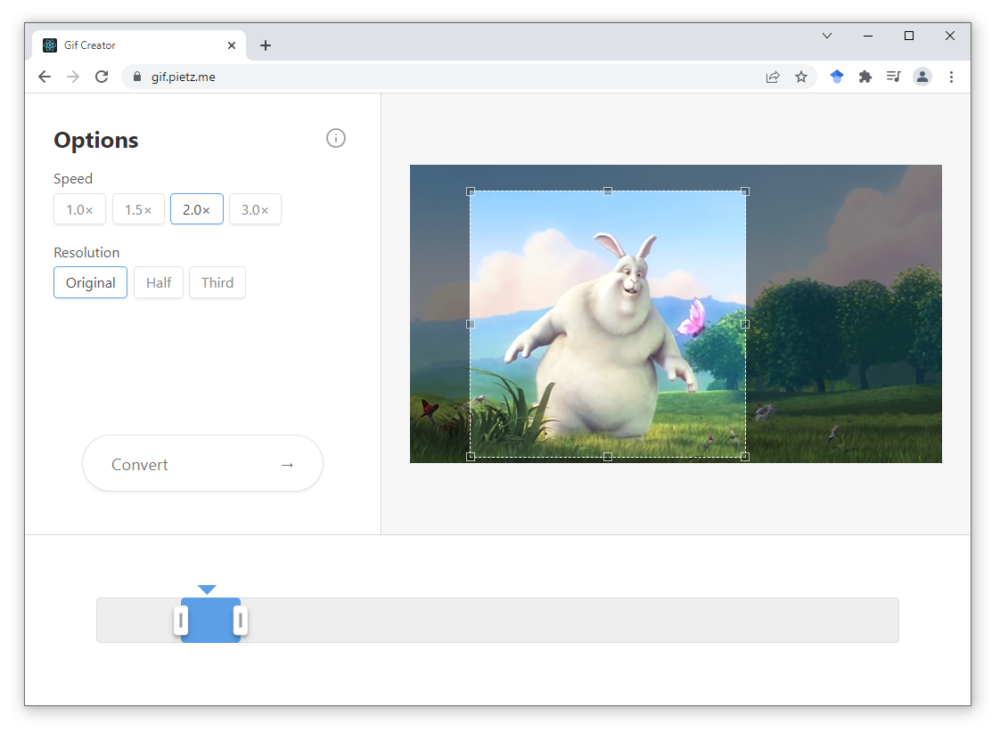

# Gif Buddy 
Easily edit videos and convert them into gifs without sending anything to a remote server.
It is primarily intended for screen captures, for example to create small demo recordings to attach to Jira issues.
You can use the public deployment over at [gif.pietz.me](https://gif.pietz.me/) or host it yourself.

